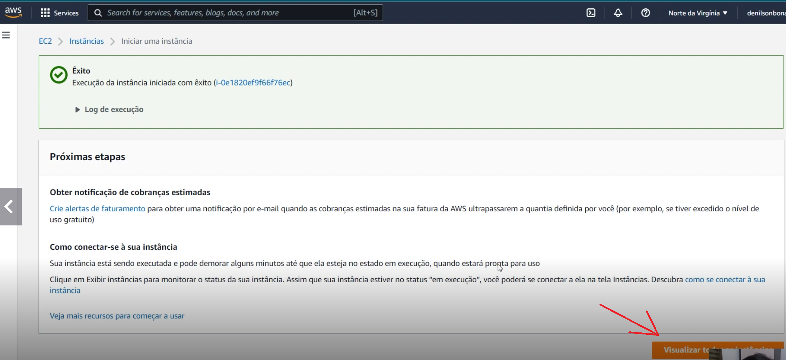
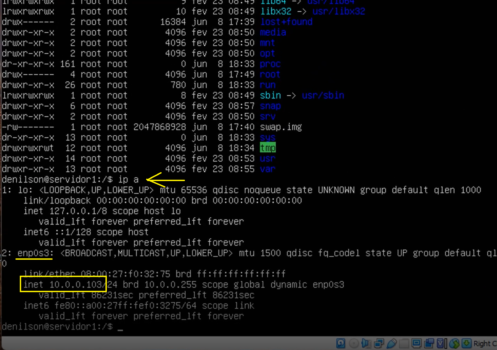
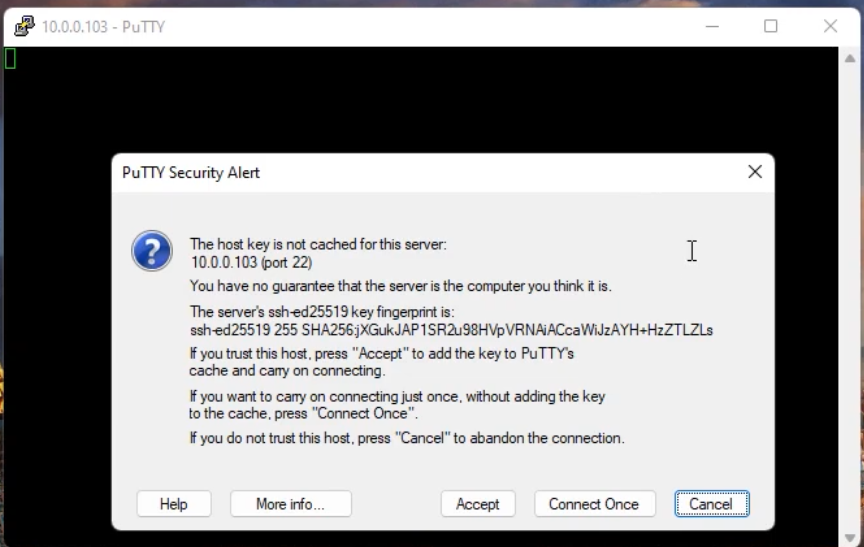
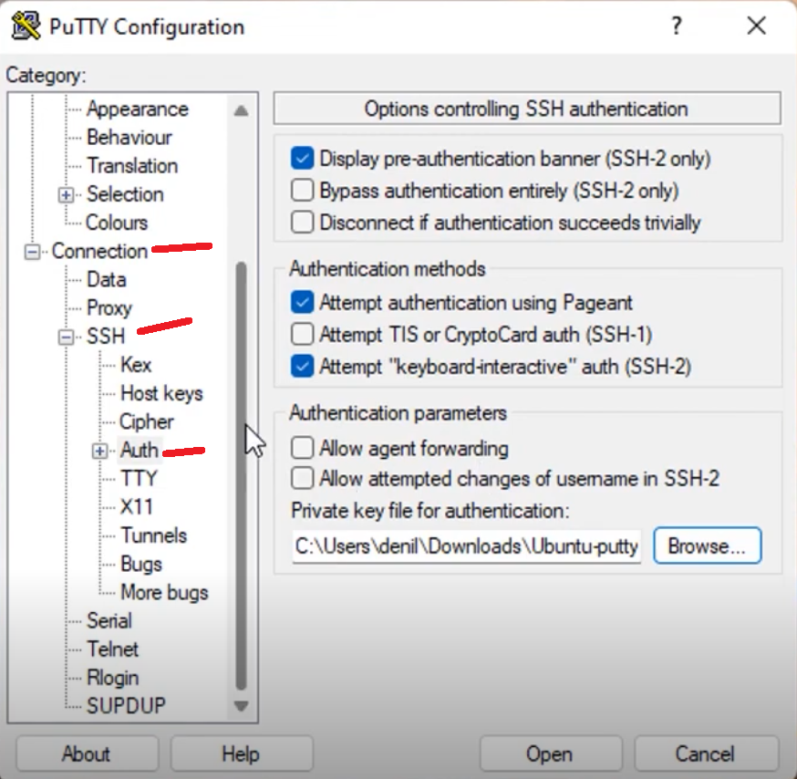
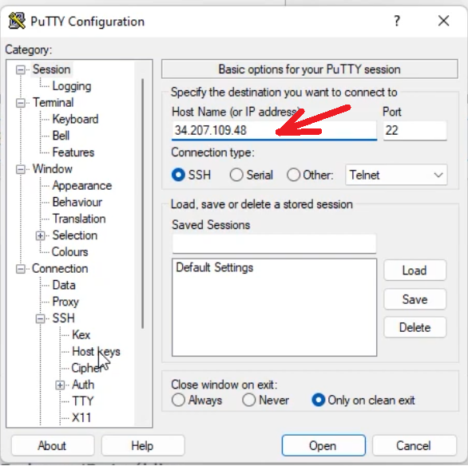
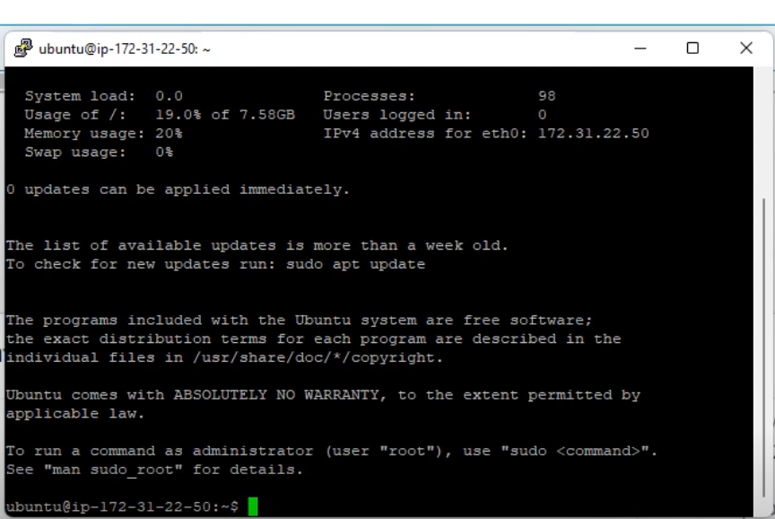

# 


<div align="center">
  
# 🛡️ Desbravando o Linux Ubuntu


</div>

---

## 📋 Sumário
* [🎯 Objetivo deste tópico](#-objetivo-deste-tópico)
* [⚙️ Detalhes da Instalação e Versões](#-objetivo-deste-t%C3%B3pico)
* [🛠️ Configuração do Ambiente](#%EF%B8%8F-detalhes-da-instalação-e-versões)
* [🛠️ Criando uma máquina virtual com Linux Ubuntu na AWS](#%EF%B8%8F-detalhes-da-instalação-e-versões)
* [🛠️ Simulando acesso remoto do windows na máquina virtual do VirtualBox](#%EF%B8%8F-simulando-acesso-remoto-do windows-na-máquina-virtual-do-virtualbox)


* [🔗 Como Contribuir / Contato](#-como-contribuir--contato)

---

## 🎯 Objetivo deste tópico

Abordarei funcinalidades básicas para utilizar o SO Linux Ubuntu, entre instalação, preparação de ambiente virtualizado, acesso remoto e comandos

> ⚠️ **Disclaimer:** Este projeto foi realizado estritamente em um ambiente de laboratório isolado, utilizando máquinas virtuais propositalmente vulneráveis (Metasploitable 2 e DVWA), com o único propósito de aprendizado e auditoria de segurança.

## ⚙️ Detalhes da Instalação e Versões

| Ferramenta | Link | Versão Utilizada
| :---: | :---: | :---: |
| VirtualBox	| https://download.virtualbox.org/virtualbox/7.2.2/VirtualBox-7.2.2-170484-Win.exe |	7.2.2
| Linux Ubuntu	| https://ubuntu.com/download/server/thank-you?version=20.04.6&architecture=amd64&lts=true | 20.04.6 LTS
| Putty	| https://the.earth.li/~sgtatham/putty/latest/w64/putty.exe |	64-bit x86
| PuttyGen	| https://the.earth.li/~sgtatham/putty/latest/w64/puttygen.exe | 64-bit x86

## 🛠️  Configuração do Ambiente

1. **Instalação do VirtualBox -** A instalação é bem simples, no meu caso, segui com as opções padrões até a finalização.
2. **Configurações iniciais para uso da virtualização -** Precisamos seguir os passos antes da instalação da ISO:
   </br></br>
   &nbsp;&nbsp;&nbsp;&nbsp;&nbsp; 2.1. **Abra o CMD em modo admistrador -** No CMD digite o seguinte comando `BCDEDIT` e clique em enter. </br></br>
   &nbsp;&nbsp;&nbsp;&nbsp;&nbsp; 2.2. **Verifique o item hypervisorlauchtype -** Verique se o item está como `off`, se não estiver, digite o seguinte comando para deixá-lo, `BCDEDIT /SET hypervisorlauchtype OFF`. O objetivo é desabilitá-lo para permitir a criação de máquina virtual. Observe a imagem abaixo. </br></br>

<div align="right">
  <details>
    <summary font-weight: bold;">
      [Preparação do ambiente]
    </summary>
    
  </details>
</div>

   
3. **Baixando o ISO do Linux Ubuntu -** Baixe o ISO para, posteriormente, fazendo a instalação no VirtualBox. (Link no item `Detalhes da Instalação e Versões`)
4. **Instalando o ISO no VirtualBox -** Com o VirtualBox aberto, clique no botão New(novo), escolha um nome para a imagem e selecione o arquivo ISO apontando para o diretório onde foi feito o download. Observe a imagem abaixo.

<div align="right">
  <details>
    <summary font-weight: bold;">
      [Configuração da ISO]
    </summary>
    
  </details>
</div>
 
  &nbsp;&nbsp;&nbsp;&nbsp;&nbsp; 4.1. **Tamanho da Memória -** Neste item mantenha o tamanho de 1024 mb.  </br></br>
  &nbsp;&nbsp;&nbsp;&nbsp;&nbsp; 4.2. **Criar disco rígido virtual -** Neste item mantenha o tamanho do disco em 20 gb. Depois disso clique em `criar`.  </br></br>
  
5. **Configuração de rede -** Com a máquina virtual criada, vá em `configurações` e selecione o item `rede`. Faça as configurações conforme imagem abaixo:

<div align="right">
  <details>
    <summary font-weight: bold;">
      [Configuração de rede]
    </summary>
    
  </details>
</div>

6. **Subindo a máquina virtual -** Clique em `Iniciar` para subir a máquina e começarmos a instação / configuração do SO.
7. **Configuração do Sistema Operacional Linux Ubuntu -** Siga os passos abaixo: </br>

&nbsp;&nbsp;&nbsp;&nbsp;&nbsp; 7.1 **Configuração de Idioma -** Selecione o idioma Português. Observe a imagem abaixo.

<div align="right">
  <details>
    <summary font-weight: bold;">
      [Configuração do Idioma]
    </summary>
    
  </details>
</div>

&nbsp;&nbsp;&nbsp;&nbsp;&nbsp; 7.2 **Proximo passo -** Selecione a opção `Continue without updating`. Observe a imagem abaixo.

<div align="right">
  <details>
    <summary font-weight: bold;">
      [Configuração do SO]
    </summary>
    
  </details>
</div>

&nbsp;&nbsp;&nbsp;&nbsp;&nbsp; 7.3 **Configuração de Teclado -** Em `Layout`, selecione a opção `Portuguese (Brazil)`, depois selecione `Concluído` e aperte enter. Observe a imagem abaixo.

<div align="right">
  <details>
    <summary font-weight: bold;">
      [Configuração do teclado]
    </summary>
    
  </details>
</div>

&nbsp;&nbsp;&nbsp;&nbsp;&nbsp; 7.4 **Definição de rede -** Neste ponto não faremos nada, apenas selecione `Concluído` e aperte enter.  </br></br>
&nbsp;&nbsp;&nbsp;&nbsp;&nbsp; 7.5 **Definição de proxy -** Neste ponto não faremos nada, apenas selecione `Concluído` e aperte enter.  </br></br>
&nbsp;&nbsp;&nbsp;&nbsp;&nbsp; 7.6 **Definição de Servidor Espelho -** Neste ponto não faremos nada, apenas selecione `Concluído` e aperte enter.  </br></br>
&nbsp;&nbsp;&nbsp;&nbsp;&nbsp; 7.7 **Definição de Disco Virtual -** Neste ponto não faremos nada, apenas selecione `Concluído` e aperte enter.  </br></br>
&nbsp;&nbsp;&nbsp;&nbsp;&nbsp; 7.8 **Definição de Partição -** Neste ponto não faremos nada, apenas selecione `Concluído` e aperte enter.  </br></br>
&nbsp;&nbsp;&nbsp;&nbsp;&nbsp; 7.9 **Finalizando Instalação -** Selecione o item `Continue` e aperte enter. Observe a imagem abaixo.

<div align="right">
  <details>
    <summary font-weight: bold;">
      [Concluindo instalação]
    </summary>
    
  </details>
</div>

&nbsp;&nbsp;&nbsp;&nbsp;&nbsp; 8.0 **Definindo Usuário do sistema -** Defina conforme abaixo: </br></br> 
&nbsp;&nbsp;&nbsp;&nbsp;&nbsp;&nbsp;&nbsp;&nbsp;&nbsp;&nbsp; 8.0.1 **Your Name -** Insira seu nome. </br></br>
&nbsp;&nbsp;&nbsp;&nbsp;&nbsp;&nbsp;&nbsp;&nbsp;&nbsp;&nbsp; 8.0.2 **Your server's name -** Insira um nome para o servidor. </br></br>
&nbsp;&nbsp;&nbsp;&nbsp;&nbsp;&nbsp;&nbsp;&nbsp;&nbsp;&nbsp; 8.0.3 **Pick a username -** Insira um usuário. </br></br>
&nbsp;&nbsp;&nbsp;&nbsp;&nbsp;&nbsp;&nbsp;&nbsp;&nbsp;&nbsp; 8.0.4 **Chosse a password -** Insira uma senha. </br></br>
&nbsp;&nbsp;&nbsp;&nbsp;&nbsp;&nbsp;&nbsp;&nbsp;&nbsp;&nbsp; 8.0.5 **Confirm your password -** Confirme a senha. Observe a imagem abaixo.

<div align="right">
  <details>
    <summary font-weight: bold;">
      [Configuração de usuário]
    </summary>
    
  </details>
</div>

&nbsp;&nbsp;&nbsp;&nbsp;&nbsp; 8.1 **Definição de Token -** Neste ponto não faremos nada, apenas selecione `Concluído` e aperte enter.  </br></br>
&nbsp;&nbsp;&nbsp;&nbsp;&nbsp; 8.2 **Definição de Token -** Neste ponto não faremos nada, apenas selecione `Concluído` e aperte enter.  </br></br>
&nbsp;&nbsp;&nbsp;&nbsp;&nbsp; 8.3 **Instalação do OpenSSH -** Neste ponto não faremos nada, apenas selecione `Concluído` e aperte enter.  </br></br>
&nbsp;&nbsp;&nbsp;&nbsp;&nbsp; 8.4 **Instalação de serviços -** Neste ponto não faremos nada, apenas selecione `Concluído` e aperte enter.  </br></br>

8. **Concluíndo a Instalação -** A partir deste ponto a instalação iniciará e devemos aguardar a conclusão. Quando finalizar, selecione `Reboot Now` e aperte enter. Observe a imagem abaixo. 

<div align="right">
  <details>
    <summary font-weight: bold;">
      [Conclusão da instalação]
    </summary>
    
  </details>
</div>

9. **Subindo a máquina virtual -** Depois de subir a máquina virtual, digite o usuário e senha que foram criados no item `8.0`, e aperte enter. Observe a imagem abaixo. 

<div align="right">
  <details>
    <summary font-weight: bold;">
      [Subindo MV]
    </summary>
    
  </details>
</div>

10. **Verificando SO ativo -** Após digitar o usuário e senha, verifique se realmente está no sistema operacional. Na linha de comando deve aparecer `nome-usuário@nomeservidor`. Observe a imagem abaixo. 

<div align="right">
  <details>
    <summary font-weight: bold;">
      [Sistema Operacional ativo]
    </summary>
    
  </details>
</div>

## 🛠️ Criando uma máquina virtual com Linux Ubuntu na AWS

> ⚠️ **Observação:** Para seguirmos com este passo, é necessário ter uma conta na AWS. Não abordarei este tópico e considerarei que vc já tenha uma conta para seguirmos com a criação da máquina virtual.

1. **Serviço EC2 da AWS-** No serviço EC2 é onde criaremos nossa máquina virtual. Na barra de pesquisa, digite `EC2`, quando aparecer a opção, clique para acessar o ambiente.  Observe a imagem abaixo. 

<div align="right">
  <details>
    <summary font-weight: bold;">
      [Pesquisando o EC2]
    </summary>
    
  </details>
</div>

2. **Serviço EC2 da AWS-** Clique em `Executar instância`.  Observe a imagem abaixo. 

<div align="right">
  <details>
    <summary font-weight: bold;">
      [Acessando o EC2]
    </summary>
    
  </details>
</div>

3. **Serviço EC2 da AWS-** Digite o nome da máquina virtual no campo `Nome` e selecione o Sistema Operacional.  Observe a imagem abaixo.

<div align="right">
  <details>
    <summary font-weight: bold;">
      [Configurando a MV no EC2]
    </summary>
    
  </details>
</div>

4. **Serviço EC2 da AWS-** No item `Par de chaves (Login)` clique em `Criar novo par de chaves`.  Observe a imagem abaixo.

<div align="right">
  <details>
    <summary font-weight: bold;">
      [Configurando a MV no EC2]
    </summary>
    
  </details>
</div>

5. **Serviço EC2 da AWS-** No campo `Nome do par de cahves`, de um nome e clique em `Criar par de chaves`.  Observe a imagem abaixo.

<div align="right">
  <details>
    <summary font-weight: bold;">
      [Configurando par de chaves]
    </summary>
    
  </details>
</div>

6. **Serviço EC2 da AWS-** Após o clique em `Criar par de chaves`, será feito automaticamente um download do `nomedoarquivo.pem`. Este arquivo usaremo posteriormente para realizar acesso remoto.
7. **Serviço EC2 da AWS-** Para finalizar, clique em `Executar Instância`. Ao final, teremos a criação finalizara, depois disso clique no botão `Visualizar todas as instâncias`. Observe a imagem abaixo.

<div align="right">
  <details>
    <summary font-weight: bold;">
      [Verificando instância criada]
    </summary>
    
  </details>
</div>

8. **Serviço EC2 da AWS-** Agora devemos ter a instância de uma máquina virtual rodando com o Linux Ubuntu. Observe a imagem abaixo.

<div align="right">
  <details>
    <summary font-weight: bold;">
      [Instância em execução]
    </summary>
    
  </details>
</div>

## 🛠️ Simulando acesso remoto do windows na máquina virtual do VirtualBox.

> Criamos 2 maquinas virtuais roando o Linux Ubuntu, uma no VirtualBox e uma na AWS. A partir de agora vamos simular acesso remoto de uma máquina Windows em ambas máquinas virtuais.

1. **Passo 1 -** Suba a imagem do Linux Ubuntu no VirtualBox para simular um servidor remoto. Em seguida, usaremos o Windows para acessar essa máquina virtual como se estivéssemos nos conectando a um computador em outro local. </br>
2. **Passo 2 -** Com o SO ativo, na linha de comando digite `ip a`, para listar os dados da rede ao qual a imagem está conectada. Precisaremos da informação do IP para realizar o acesso remoto. Precisado do ip localizado no `inet`, abaixo do item `enp0s3`, Observe a imagem abaixo.

<div align="right">
  <details>
    <summary font-weight: bold;">
      [Ip da rede da Máquina Virtual]
    </summary>
    
  </details>
</div>

3. **Passo 3 -** Execute o putty.exe (Link no item `Detalhes da Instalação e Versões`), digite no campo `Host Name (or IP address)` o IP da máquina virtual, listado no passo anterior.  Observe a imagem abaixo.

<div align="right">
  <details>
    <summary font-weight: bold;">
      [Executando o Putty]
    </summary>
    
  </details>
</div>

4. **Passo 4 -** É possível que ocorra um erro de `Conexão recusada`, caso isso aconteça, será necessário instalarmos o SSH na imagem do Linux Ubuntu e executarmos uma série de comando. 
  
&nbsp;&nbsp;&nbsp;&nbsp;&nbsp; 3.1 **Instalando o SSH na imagem do Linux** - no prompt de comando, digite o comando abaixo:
  ```bash
  sudo apt-get install openssh-server
  ```
&nbsp;&nbsp;&nbsp;&nbsp;&nbsp; 3.2 **Instalando o SSH na imagem do Linux** - Será solicitado a senha para seguir com a instalação. Após colocar a senha, ele pedirá a confirmação para seguir com a instalação. Confirme e tecle enter. Observe a imagem abaixo.

<div align="right">
  <details>
    <summary font-weight: bold;">
      [Instalando o SSh]
    </summary>
    
  </details>
</div>

&nbsp;&nbsp;&nbsp;&nbsp;&nbsp; 3.2 **Verifique se o serviço está rodando -** Digite o comando abaixo:
  ```bash
sudo systemctl status ssh
  ```
Se aparecer `active (running)`, o serviço está pronto.

Se aparecer `inactive` ou `dead`, execute os comandos abaixo.

&nbsp;&nbsp;&nbsp;&nbsp;&nbsp; 3.3 **Inicie e habilite o serviço -** Digite o comando abaixo:
  ```bash
sudo systemctl start ssh
sudo systemctl enable ssh
  ```
&nbsp;&nbsp;&nbsp;&nbsp;&nbsp; 3.4 **Confirme a porta de escuta -** Para ter certeza absoluta que o Linux está ouvindo na porta 22, use:
  ```bash
ss -tlpn | grep :22
  ```
Deve aparecer uma linha indicando que o processo sshd está em LISTEN

&nbsp;&nbsp;&nbsp;&nbsp;&nbsp; 3.5 **Force a execução do serviço -**  No terminal do seu Ubuntu, execute o comando para forçar o início do serviço:
  ```bash
sudo systemctl start ssh
  ```
Após executar o comando acima, valide se ele subiu com:
  ```bash
sudo systemctl status ssh
  ```
O que observar: O campo Active deve mudar de inactive `dead` para active `running` em verde.

5. **Passo 5 -** Execute o putty.exe (Link no item `Detalhes da Instalação e Versões`), digite no campo `Host Name (or IP address)` o IP da máquina virtual. Clique em `Accept`. Observe a imagem abaixo.

<div align="right">
  <details>
    <summary font-weight: bold;">
      [Acesso Remoto]
    </summary>
    
  </details>
</div>

6. **Passo 6 -** Agora ele vai pedir o usuário e senha. A partir deste ponto, estaremos conectados remotamente na máquinha com o SO Linux. Observe a imagem abaixo.

<div align="right">
  <details>
    <summary font-weight: bold;">
      [Acesso Remoto]
    </summary>
    
  </details>
</div>

## 🛠️ Simulando acesso remoto do windows na máquina virtual da AWS.

1. **Passo 1 -** Neste instante, precisaremos executar o `PuttyGen`. Clique no botão `Load` e selecione o arquivo `.pem` com a chave que criamos no passo da criação da máquina virtual na AWS. Após carregar, clique no botão `Save private key`, neste momento ele criará um arquivo com a extensão  `.ppk`. Observe a imagem abaixo.

<div align="right">
  <details>
    <summary font-weight: bold;">
      [Convertendo arquivo com a chave de acesso]
    </summary>
    
  </details>
</div>

2. **Passo 2 -** Agora vamos atribuir esse arquivo `.ppk` no putty para realizar o acesso remoto. Na arvore, clique na opção `Connection / SSH / Auth`, procure pelo campo `Private key file for authentication`, e carregue o arquivo `.ppk` gerado no passo anterior.  Observe a imagem abaixo.

<div align="right">
  <details>
    <summary font-weight: bold;">
      [Carregando a chave .PPK no Putty]
    </summary>
    
  </details>
</div>

3. **Passo 3 -** Agora vamos pegar o IP da máquina virtual na AWS.  Observe a imagem abaixo.

<div align="right">
  <details>
    <summary font-weight: bold;">
      [IP da MV AWS]
    </summary>
    
  </details>
</div>

4. **Passo 4 -** Inclua o endereço IP no putty e clique em `Open`.  Observe a imagem abaixo.

<div align="right">
  <details>
    <summary font-weight: bold;">
      [Conexão via putty]
    </summary>
    
  </details>
</div>

5. **Passo 5 -** Agora finalizaremos a conexão. Neste momento ele irá pedir o usuário, que na AWS ele cria por padrão o usuário `Open`. Como a chave foi importada, não há necessidade de digitar senha.  Observe a imagem abaixo.

<div align="right">
  <details>
    <summary font-weight: bold;">
      [Conexão realizada]
    </summary>
    
  </details>
</div>

6. **Passo 6 -** Neste ponto mostra a interface do ubuntu e podemos digitar comandos unix para teste.  Observe a imagem abaixo.

<div align="right">
  <details>
    <summary font-weight: bold;">
      [Interface Ubuntu]
    </summary>
    
  </details>
</div>

## 🔗 **Como Contribuir / Contato**</br></br>
Este projeto foi desenvolvido como parte de um desafio prático de segurança cibernética. Sinta-se à vontade para explorá-lo, cloná-lo e adaptá-lo!

| Botão | Ação |
| :--- | :--- |
| ⭐ Dar Estrela | Se gostou do projeto, considere dar uma estrela no GitHub. |
| 🤝 Conecte-se | ** <a href="https://www.linkedin.com/in/leandro-antonio-fortunato/" target="_blank">  Visite meu linkedin</a>**  |
| 📧 Fale Comigo | 📧 [E-mail para contato](mailto:leandroantonio.fortunato@hotmail.com) |

