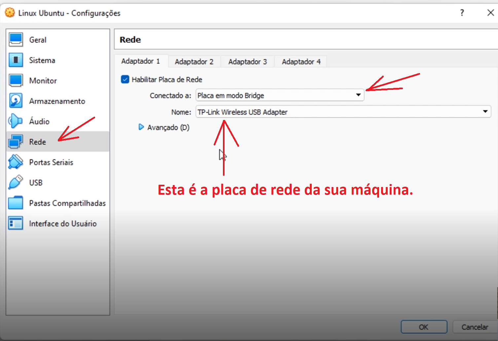
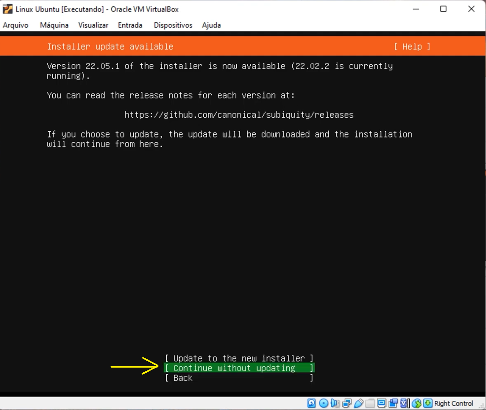
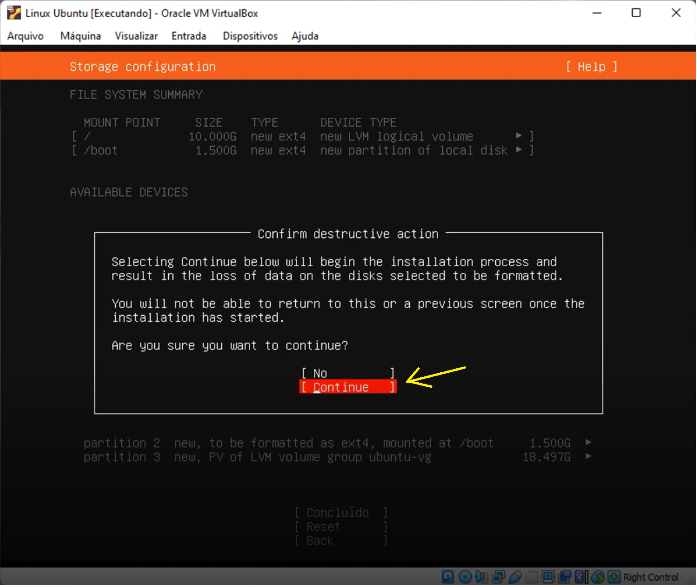
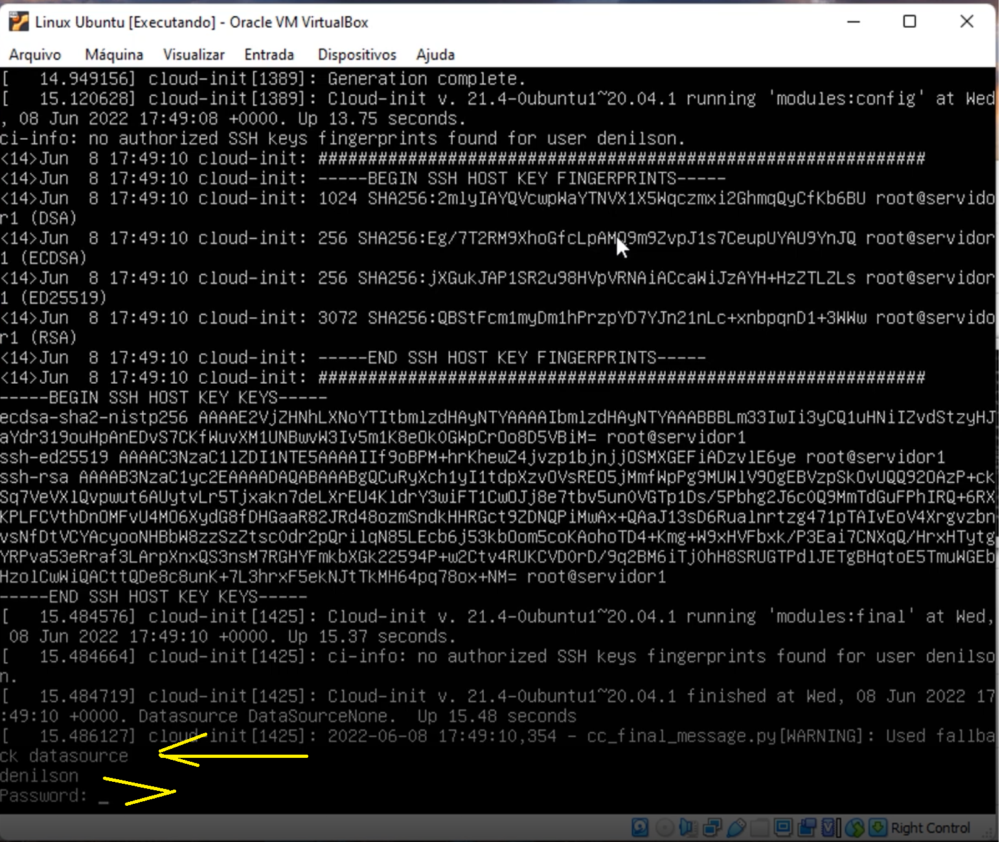
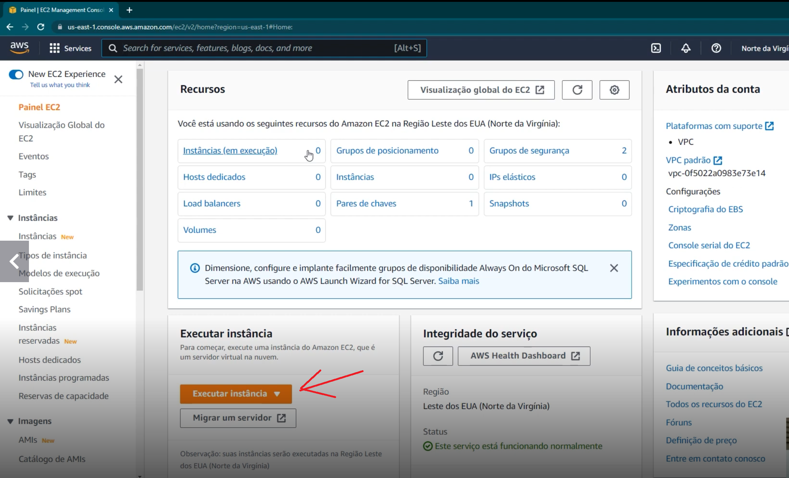
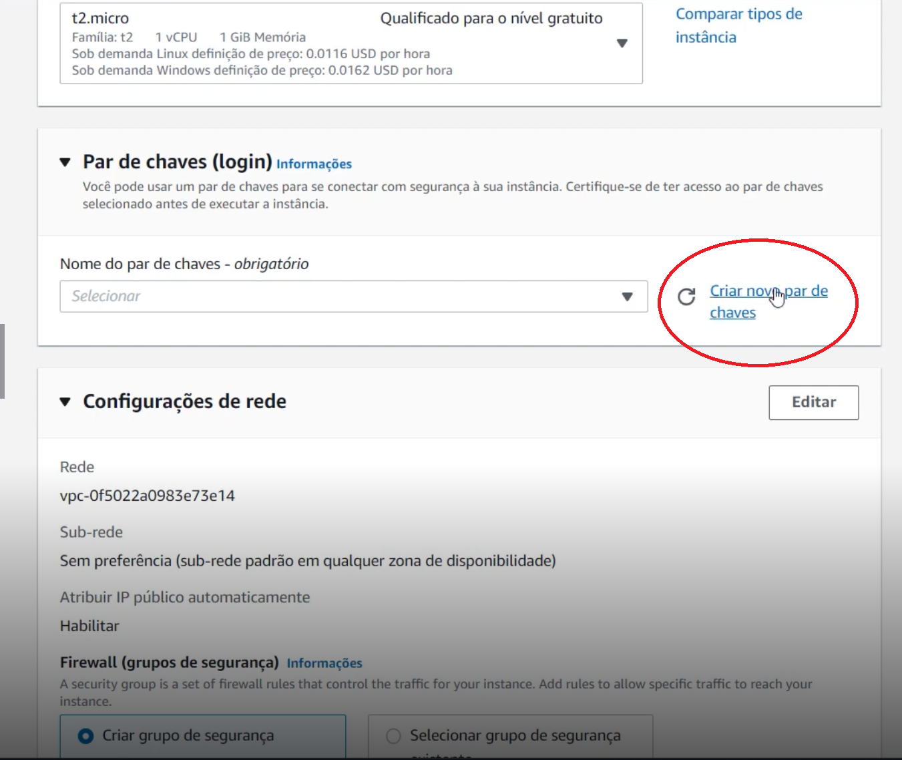
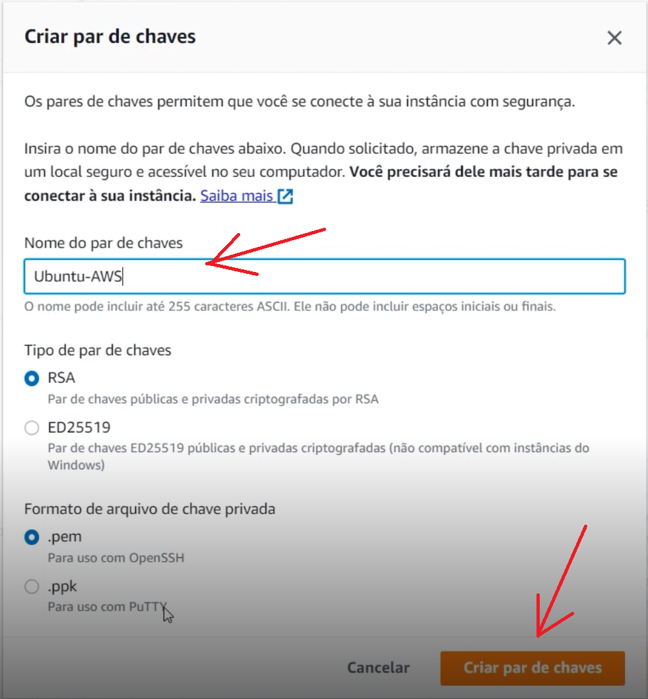

# 

  
# 🛡️ Desbravando o Linux Ubuntu

---

## 📋 Sumário
* [🎯 Objetivo deste tópico](#-Objetivo-deste-tópico)
* [⚙️ Detalhes da Instalação e Versões](#%EF%B8%8F-detalhes-da-instalação-e-versões)
* [🛠️ Configuração do Ambiente](#%EF%B8%8F-detalhes-da-instalação-e-versões)
* [🛠️ Criando uma máquina virtual com Linux Ubuntu na AWS](#%EF%B8%8F-detalhes-da-instalação-e-versões)
  
* [🚀 Enumeração de Serviços (Reconhecimento Ativo)](#-enumeração-de-serviços-reconhecimento-ativo)
* [📋 Criação das Wordlists (Lista de Tentativas)](#-criação-das-wordlists-lista-de-tentativas)
* [💥 1. Ataque de Força Bruta em Serviço FTP com Hydra](#-1-ataque-de-força-bruta-em-serviço-ftp-com-hydra)
* [💥 2. Ataque de Força Bruta em Serviço FTP com Medusa](#-2-ataque-de-força-bruta-em-serviço-ftp-com-medusa)
* [💥 3. Ataque de Força Bruta em Formulário Web (DVWA)](#-3-ataque-de-força-bruta-em-formulário-web-dvwa)
* [💥 4. Ataque de Força Bruta em Serviço SMB com Password Spraying e Enumeração (Hydra e Medusa)](#-4-ataque-de-força-bruta-em-serviço-smb-com-password-spraying-e-enumeração-hydra-e-medusa)
* [🛡️ Medidas de Mitigação e Recomendações de Segurança](#%EF%B8%8F-medidas-de-mitigação-e-recomendações-de-segurança-)
* [🔗 Como Contribuir / Contato](#-como-contribuir--contato)

---

## 🎯 Objetivo deste tópico

Abordarei funcinalidades básicas para utilizar o SO Linux Ubuntu, entre instalação, preparação de ambiente virtualizado, acesso remoto e comandos

> ⚠️ **Disclaimer:** Este projeto foi realizado estritamente em um ambiente de laboratório isolado, utilizando máquinas virtuais propositalmente vulneráveis (Metasploitable 2 e DVWA), com o único propósito de aprendizado e auditoria de segurança.

## ⚙️ Detalhes da Instalação e Versões

| Ferramenta | Link | Versão Utilizada
| :---: | :---: | :---: |
| VirtualBox	| https://download.virtualbox.org/virtualbox/7.2.2/VirtualBox-7.2.2-170484-Win.exe |	7.2.2
| Linux Ubuntu	| https://ubuntu.com/download/server/thank-you?version=20.04.6&architecture=amd64&lts=true | 20.04.6 LTS
| Putty	| https://sourceforge.net/projects/metasploitable/files/latest/download |	2.0.0
| PuttyGen	| sudo apt install hydra (Se não estiver instalado)	hydra -V | 9.5

## 🛠️  Configuração do Ambiente

1. **Instalação do VirtualBox -** A instalação é bem simples, no meu caso, segui com as opções padrões até a finalização.
2. **Configurações iniciais para uso da virtualização -** Precisamos seguir os passos antes da instalação da ISO:
     
   &nbsp;&nbsp;&nbsp;&nbsp;&nbsp; 2.1. **Abra o CMD em modo admistrador -** No CMD digite o seguinte comando `BCDEDIT` e clique em enter.   
   &nbsp;&nbsp;&nbsp;&nbsp;&nbsp; 2.2. **Verifique o item hypervisorlauchtype -** Verique se o item está como `off`, se não estiver, digite o seguinte comando para deixá-lo, `BCDEDIT /SET hypervisorlauchtype OFF`. O objetivo é desabilitá-lo para permitir a criação de máquina virtual. Observe a imagem abaixo.   

  

    

      [Preparação do ambiente]
    

    
  

   
3. **Baixando o ISO do Linux Ubuntu -** Baixe o ISO para, posteriormente, fazendo a instalação no VirtualBox. (Link no item `Detalhes da Instalação e Versões`)
4. **Instalando o ISO no VirtualBox -** Com o VirtualBox aberto, clique no botão New(novo), escolha um nome para a imagem e selecione o arquivo ISO apontando para o diretório onde foi feito o download. Observe a imagem abaixo.

  

    

      [Configuração da ISO]
    

    
  

 
  &nbsp;&nbsp;&nbsp;&nbsp;&nbsp; 4.1. **Tamanho da Memória -** Neste item mantenha o tamanho de 1024 mb.    
  &nbsp;&nbsp;&nbsp;&nbsp;&nbsp; 4.2. **Criar disco rígido virtual -** Neste item mantenha o tamanho do disco em 20 gb. Depois disso clique em `criar`.    
  
5. **Configuração de rede -** Com a máquina virtual criada, vá em `configurações` e selecione o item `rede`. Faça as configurações conforme imagem abaixo:

  

    

      [Configuração de rede]
    

    
  

6. **Subindo a máquina virtual -** Clique em `Iniciar` para subir a máquina e começarmos a instação / configuração do SO.
7. **Configuração do Sistema Operacional Linux Ubuntu -** Siga os passos abaixo:  

&nbsp;&nbsp;&nbsp;&nbsp;&nbsp; 7.1 **Configuração de Idioma -** Selecione o idioma Português. Observe a imagem abaixo.

  

    

      [Configuração do Idioma]
    

    
  

&nbsp;&nbsp;&nbsp;&nbsp;&nbsp; 7.2 **Proximo passo -** Selecione a opção `Continue without updating`. Observe a imagem abaixo.

  

    

      [Configuração do SO]
    

    
  

&nbsp;&nbsp;&nbsp;&nbsp;&nbsp; 7.3 **Configuração de Teclado -** Em `Layout`, selecione a opção `Portuguese (Brazil)`, depois selecione `Concluído` e aperte enter. Observe a imagem abaixo.

  

    

      [Configuração do teclado]
    

    
  

&nbsp;&nbsp;&nbsp;&nbsp;&nbsp; 7.4 **Definição de rede -** Neste ponto não faremos nada, apenas selecione `Concluído` e aperte enter.    
&nbsp;&nbsp;&nbsp;&nbsp;&nbsp; 7.5 **Definição de proxy -** Neste ponto não faremos nada, apenas selecione `Concluído` e aperte enter.    
&nbsp;&nbsp;&nbsp;&nbsp;&nbsp; 7.6 **Definição de Servidor Espelho -** Neste ponto não faremos nada, apenas selecione `Concluído` e aperte enter.    
&nbsp;&nbsp;&nbsp;&nbsp;&nbsp; 7.7 **Definição de Disco Virtual -** Neste ponto não faremos nada, apenas selecione `Concluído` e aperte enter.    
&nbsp;&nbsp;&nbsp;&nbsp;&nbsp; 7.8 **Definição de Partição -** Neste ponto não faremos nada, apenas selecione `Concluído` e aperte enter.    
&nbsp;&nbsp;&nbsp;&nbsp;&nbsp; 7.9 **Finalizando Instalação -** Selecione o item `Continue` e aperte enter. Observe a imagem abaixo.

  

    

      [Concluindo instalação]
    

    
  

&nbsp;&nbsp;&nbsp;&nbsp;&nbsp; 8.0 **Definindo Usuário do sistema -** Defina conforme abaixo:    
&nbsp;&nbsp;&nbsp;&nbsp;&nbsp;&nbsp;&nbsp;&nbsp;&nbsp;&nbsp; 8.0.1 **Your Name -** Insira seu nome.   
&nbsp;&nbsp;&nbsp;&nbsp;&nbsp;&nbsp;&nbsp;&nbsp;&nbsp;&nbsp; 8.0.2 **Your server's name -** Insira um nome para o servidor.   
&nbsp;&nbsp;&nbsp;&nbsp;&nbsp;&nbsp;&nbsp;&nbsp;&nbsp;&nbsp; 8.0.3 **Pick a username -** Insira um usuário.   
&nbsp;&nbsp;&nbsp;&nbsp;&nbsp;&nbsp;&nbsp;&nbsp;&nbsp;&nbsp; 8.0.4 **Chosse a password -** Insira uma senha.   
&nbsp;&nbsp;&nbsp;&nbsp;&nbsp;&nbsp;&nbsp;&nbsp;&nbsp;&nbsp; 8.0.5 **Confirm your password -** Confirme a senha. Observe a imagem abaixo.

  

    

      [Configuração de usuário]
    

    
  

&nbsp;&nbsp;&nbsp;&nbsp;&nbsp; 8.1 **Definição de Token -** Neste ponto não faremos nada, apenas selecione `Concluído` e aperte enter.    
&nbsp;&nbsp;&nbsp;&nbsp;&nbsp; 8.2 **Definição de Token -** Neste ponto não faremos nada, apenas selecione `Concluído` e aperte enter.    
&nbsp;&nbsp;&nbsp;&nbsp;&nbsp; 8.3 **Instalação do OpenSSH -** Neste ponto não faremos nada, apenas selecione `Concluído` e aperte enter.    
&nbsp;&nbsp;&nbsp;&nbsp;&nbsp; 8.4 **Instalação de serviços -** Neste ponto não faremos nada, apenas selecione `Concluído` e aperte enter.    

8. **Concluíndo a Instalação -** A partir deste ponto a instalação iniciará e devemos aguardar a conclusão. Quando finalizar, selecione `Reboot Now` e aperte enter. Observe a imagem abaixo. 

  

    

      [Conclusão da instalação]
    

    
  

9. **Subindo a máquina virtual -** Depois de subir a máquina virtual, digite o usuário e senha que foram criados no item `8.0`, e aperte enter. Observe a imagem abaixo. 

  

    

      [Subindo MV]
    

    
  

10. **Verificando SO ativo -** Após digitar o usuário e senha, verifique se realmente está no sistema operacional. Na linha de comando deve aparecer `nome-usuário@nomeservidor`. Observe a imagem abaixo. 

  

    

      [Sistema Operacional ativo]
    

    
  

## 🛠️ Criando uma máquina virtual com Linux Ubuntu na AWS

> ⚠️ **Observação:** Para seguirmos com este passo, é necessário ter uma conta na AWS. Não abordarei este tópico e considerarei que vc já tenha uma conta para seguirmos com a criação da máquina virtual.

1. **Serviço EC2 da AWS-** No serviço EC2 é onde criaremos nossa máquina virtual. Na barra de pesquisa, digite `EC2`, quando aparecer a opção, clique para acessar o ambiente.  Observe a imagem abaixo. 

  

    

      [Pesquisando o EC2]
    

    
  

2. **Serviço EC2 da AWS-** Clique em `Executar instância`.  Observe a imagem abaixo. 

  

    

      [Acessando o EC2]
    

    
  

3. **Serviço EC2 da AWS-** Digite o nome da máquina virtual no campo `Nome` e selecione o Sistema Operacional.  Observe a imagem abaixo.

  

    

      [Configurando a MV no EC2]
    

    
  

4. **Serviço EC2 da AWS-** No item `Par de chaves (Login)` clique em `Criar novo par de chaves`.  Observe a imagem abaixo.

  

    

      [Configurando a MV no EC2]
    

    
  

5. **Serviço EC2 da AWS-** No campo `Nome do par de cahves`, de um nome e clique em `Criar par de chaves`.  Observe a imagem abaixo.

  

    

      [Configurando par de chaves]
    

    
  

